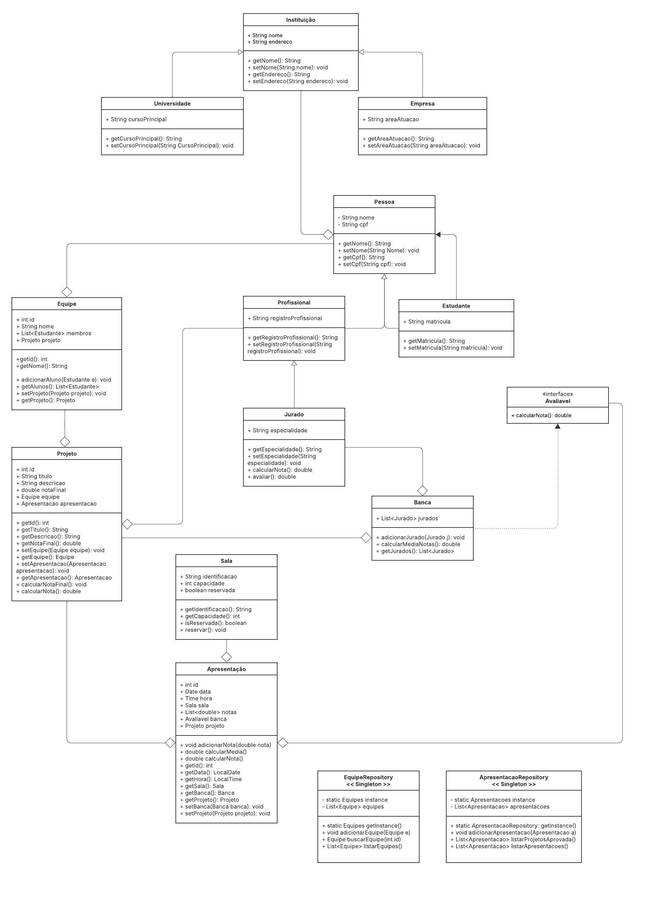

# 📘 Diagrama UML – Sistema de Hackathons Universitários

Este documento apresenta o diagrama UML que serviu como base para a modelagem do sistema de gerenciamento de Hackathons Universitários.

O objetivo principal do diagrama é representar as entidades envolvidas, suas relações e os principais métodos e atributos esperados em cada classe, de acordo com os requisitos propostos no enunciado da atividade.

---

## 📌 Visão Geral do Diagrama

O diagrama segue o paradigma de **orientação a objetos** e está estruturado em torno de:

### 1. Pessoas e Tipos

* **Pessoa** (classe base com `nome` e `cpf`)

  * `Estudante` (tem `matricula`)
  * `Profissional` (tem `registroProfissional`)

    * `Jurado` (tem `especialidade`, implementa `Avaliavel`)

### 2. Instituições

* `Instituicao` (classe base com `nome` e `endereco`)

  * `Universidade` (tem `cursoPrincipal`)
  * `Empresa` (tem `areaAtuacao`)

### 3. Projeto e Equipe

* `Equipe` (tem `id`, `nome`, lista de `Estudante`, um `Projeto`)
* `Projeto` (tem `id`, `titulo`, `descricao`, `notaFinal`, relacionado a uma `Apresentacao` e `Equipe`, implementa `Avaliavel`)

### 4. Avaliação

* `Apresentacao` (tem `data`, `hora`, `sala`, lista de `notas`, um `Projeto` e uma `Banca`, implementa `Avaliavel`)
* `Banca` (tem lista de `Jurado`, calcula média de notas)
* `Sala` (tem `identificacao`, `capacidade` e pode ser reservada)

### 5. Interface

* `Avaliavel`: Interface com o método `double calcularNota()`

---

## 🔁 Relações e Heranças

* **Generalização (herança):**

  * `Pessoa` → `Estudante`, `Profissional`
  * `Profissional` → `Jurado`
  * `Instituicao` → `Universidade`, `Empresa`

* **Composição / Associação:**

  * `Equipe` contém `Estudantes` e um `Projeto`
  * `Projeto` tem uma `Apresentacao` e uma `Equipe`
  * `Apresentacao` tem uma `Sala` e uma `Banca`
  * `Banca` é composta por `Jurados`

* **Interface:**

  * `Avaliavel` é implementada por `Projeto`, `Apresentacao` e `Jurado`

---

## 🧩 Papel do Diagrama

O diagrama UML serviu como **base de modelagem para as classes Java** implementadas na solução, ajudando a:

* Visualizar e manter coesão entre os conceitos
* Separar responsabilidades por entidade
* Representar heranças e composições com clareza
* Garantir alinhamento com os requisitos da atividade

O código Java final foi estruturado fielmente a este diagrama, mantendo a lógica das relações e especializações conforme apresentado.

---

## 📎 Acesso à Solução

➡️ [Clique aqui para acessar a documentação da implementação Java](../solucao/README.md)

---

**Autor:** Gabriel Victor
**Trabalho acadêmico – Modelagem e Programação Orientada a Objetos**
